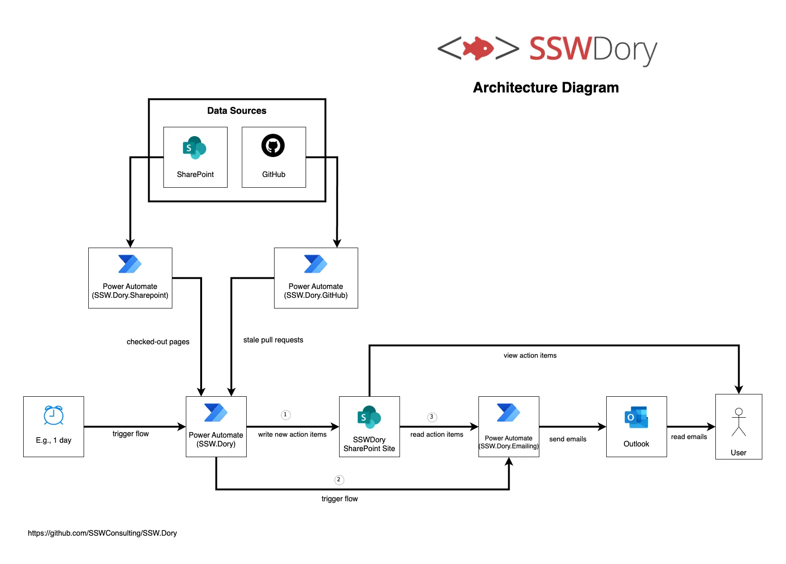

# SSW.Dory

SSW.Dory is a solution to keep track of SharePoint files that have been checked out or GitHub Pull Requests that have not been merged. The low-code solution can be found on [Microsoft Power Automate](https://github.com/SSWConsulting/SSW.Dory/wiki/Power-Automate-Flows). This repo holds the SSW.Dory website code in the [contents](https://github.com/SSWConsulting/SSW.Dory/tree/edit-readme-add-wiki/content) folder.

## See the Important Documents

- [Business](https://github.com/SSWConsulting/SSW.Dory/wiki/Business)
- [Technologies and Architecture](https://github.com/SSWConsulting/SSW.Dory/wiki/Technologies-and-Architecture)
- [Alternative Solutions Considered](https://github.com/SSWConsulting/SSW.Dory/wiki/Alternative-Solutions-Considered)
- [Definition of Done](https://github.com/SSWConsulting/SSW.Dory/wiki/Definition-of-Done)
- [Definition of Ready](https://github.com/SSWConsulting/SSW.Dory/wiki/Definition-of-Ready)
- [Power Automate Flows](https://github.com/SSWConsulting/SSW.Dory/wiki/Power-Automate-Flows)

## Architecture Diagram

