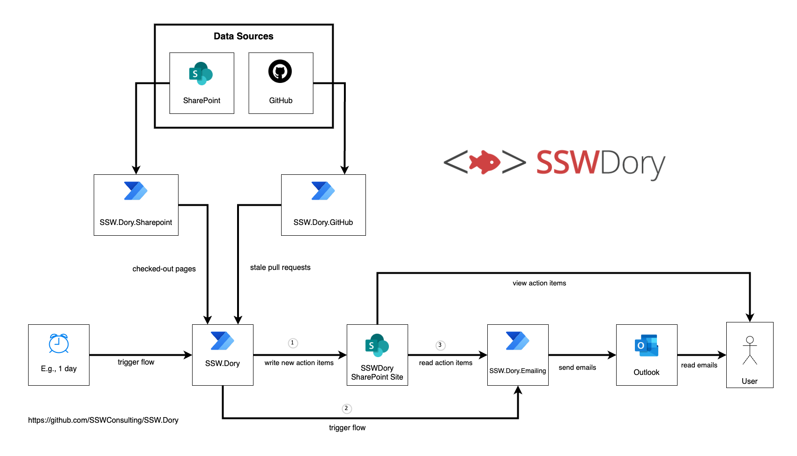
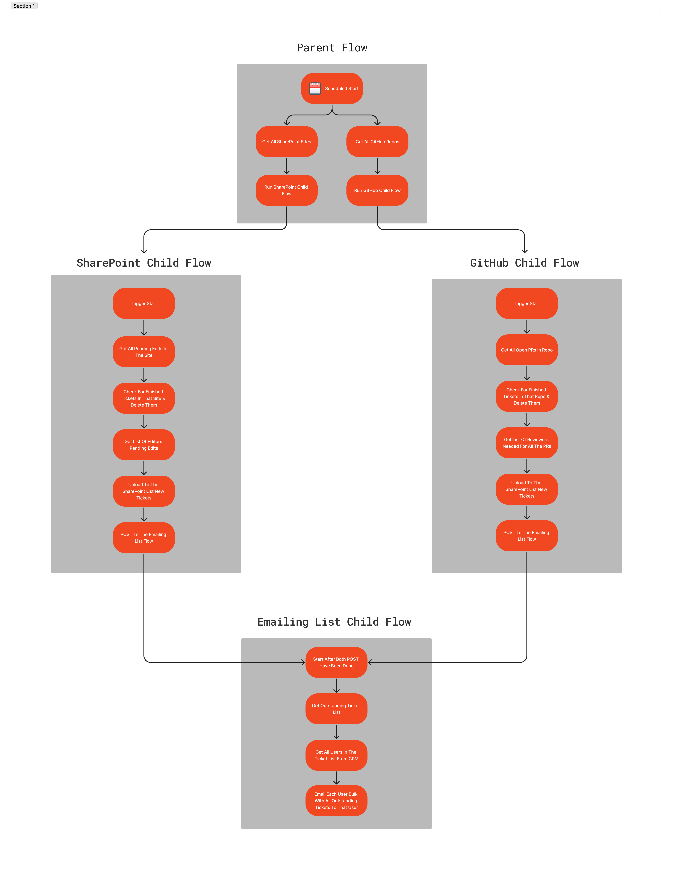

# Overview 
SSW.Dory is a solution to keep track of SharePoint files that have been checked out or GitHub Pull Requests that have not been merged. 

## Architecture Diagram

The solution is developed in Power Automate.

