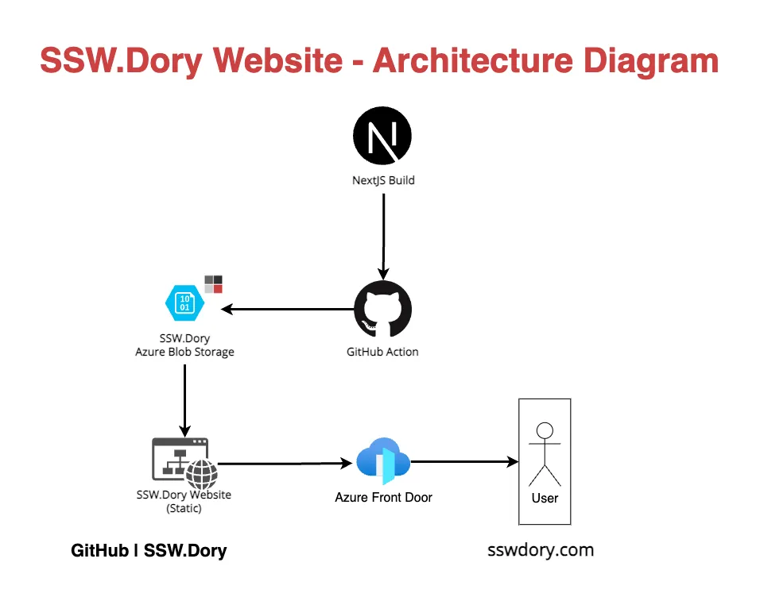

# SSW.Dory Landing Page

## Architecture Overview


## Get Started

### Install the project's dependencies:

```bash
bun install
```

### Build the project:
```bash
bun run build
```
Note - if an error comes up involving the [installation of the package sharp](https://github.com/lovell/sharp/issues/3511) while the next-image-export-optimizer is running, you'll need to postinstall sharp:
```bash
cd node_modules/sharp
bun install
```

### Run the project locally:

```bash
bun run dev
```

## Local URLs
[http://localhost:8080/](http://localhost:8080/): browse the website
